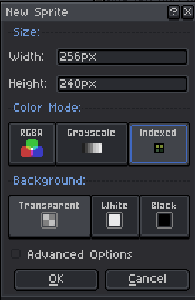

# Images

Okay, let's all agree: drawing backgrounds like this is... rough:

```armasm
mov ^0xFF30288FA878BD890CC...<some time later>...F87F $0
```

So to make it simpler to everyone - you can have your own PNG files. Those comes in two flavours: **Backgrounds** and **Sprites**

The difference is simple:
- **Backgrounds**: spans the whole 256x240 screen resolution, rewriting the whole VRAM
- **Sprites**: 8x8 pixels in size with 0 being the "transparent pixel" (Check [Palette](./palette.md))

The files should be **palette-indexed PNGs** with palette being the same you provide in the manifest (really read [Palette](./palette.md) before you read this plsss).

In [Aseprite](https://www.aseprite.org/), to create setup for palette-indexed PNGs you need to set it up like this:



with **Color mode** being set to **Indexed** and size being set either to 256x240 or 8x8. After you create the sprite - load your palette and draw! And once you're also done with that - save it as `.png` and you'll be perfectly fine
