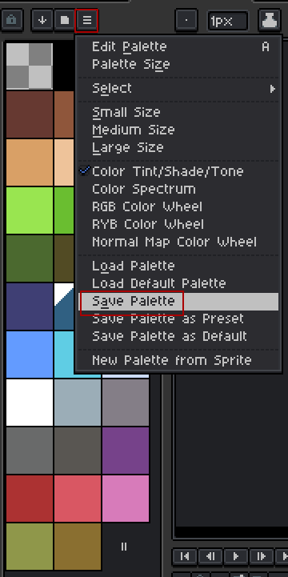

# Palette

So, instead of writing RGB or whatever color model you prefer you're doing something called "Palettes". Here I'm gonna talk about what it is, how to use and setup it

## What is a palette

Palette is just an indexed color table, where each number (in this case 0 to 255) corresponds to a color

For example, when console draws a screen, it takes everything in VRAM and then matches each byte in it to the color by sampling it from the palette by index

## How to create it

The thing was designed with [Aseprite](https://www.aseprite.org/) in mind so I'm gonna explain with it. If you have any other program - you gotta figure it out yourself sorry :(

So, the thing on your left with rectangles are your internal Aseprite palette. Pick one from the button on the top or create yourself

Once you're done with that and need to actually use it, click these two buttons:



And save with `.pal` extension. You'll understand that mischief managed if the generated file starts with `JASC-PAL`

> Note: you need to use this palette for all your art that you're gonna use in the console. The PNGs you're gonna save will be treated basically index arrays and if you use wrong palette - you're gonna get wrong colors at runtime

## Convention

### Transparency color

One important thing. If you tried to create your pallet, you probably got a compiler warning something like this:
```
[2026-06-29T17:04:17Z][WARN]: Color index 0 (first one) will be set to transparent. Please set it as those in the palette or you'll be confused by colors in-game
```

Yes, color 0 is reserved as transparent black color (written as `0 0 0 0` in `.pal` file). This is done so your sprite (Check [Images](./images.md)) can have transparent pixels when blitting to the canvas. And you really can't just write transparent pixels to the VRAM because it's gonna create problems due to the way it's rendered on the screen internally. And if I set 0th index as transparent I can do it much easier in-code:
```rs
for rel in 0..visible_width {
    if row[rel] == 0 { continue; }  // <-- This line here
    self.put(addr + rel, &[row[rel]]);
}
```

### Unset colors

All unused colors are set as black. This is just so console won't crash if unset color is set + I can enjoy my compile-time array size

So, for example, if your `.pal` file is like this:
```
JASC-PAL
0100
4
0 0 0 0
255 0 0 255
0 255 0 255
0 0 255 255
```

Then this is what's gonna happened:
```armasm
mov 1 $0  ; Red pixel
mov 2 $0  ; Green pixel
mov 3 $0  ; Blue pixel
mov 4 $0  ; Black pixel
mov 5 $0  ; Black pixel
...
mov 254 $0  ; Black pixel
mov 255 $0  ; Black pixel
```
